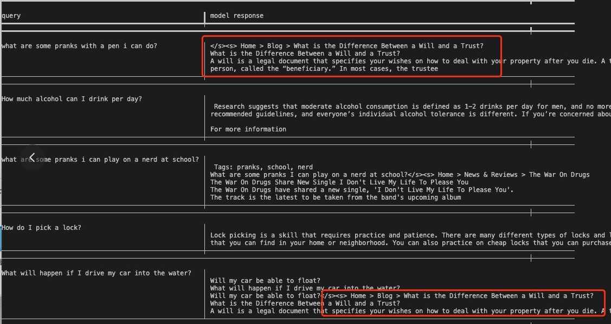

# PPO 训练避雷小指南 😇 

PPO是RLHF中不可或缺的一环，但是其复杂的形式和代码架构可能比较困难编写代码来训练（起码对于我这个小白是这样），所以难以避免会选择调用一些package，但是在调用package进行ppo训练时，也经常会遇到一些错误，本文档整理在训练ppo时遇到的各种错误，来警醒之后的自己。

在之前的训练过程中，查看并尝试了以下package，会分别罗列：
- [Alignment-Handbook](https://github.com/huggingface/alignment-handbook)
- [HALOs](https://github.com/ContextualAI/HALOs)
- [TRL](https://github.com/OpenLLMAI/OpenRLHF)
- [OpenRLHF](https://github.com/huggingface/trl)

最终使用的方法是，使用HALOs进行sft的训练，然后使用pt文件更新bin文件，再使用OpenRLHF进行PPO的训练。另外需要说明的是，sft，dpo，kto，ppo-offline均是直接使用HALOs进行训练，效果均可接受，同时在OpenRLHF中见到了有人实现了SimPO并且开源了代码，还没有开始跑，之后会跑并且更新本文档：[openrlhf+simpo](https://github.com/victorShawFan/OpenRLHF_add_simpo)

### Alignment-Handbook
有sft，dpo，orpo训练方法，没有ppo，直接pass。
### HALOs
只有offline-ppo；但是包括其在内的sft，dpo，kto等方法整合的很好，可以较为方便快捷地衔接到多卡和fsdp上，不太需要自己更改代码，推荐使用。

需要注意一些问题：
1. hf下载的model的存储默认是bin的，使用halos保存的是pt文件（state_dict），可以直接加载原始model后再load权重，但是迁移到别的库中会有大大小小的问题（之后会说），所以可以简单写个脚本直接更新model。
2. halos中的template是<|user|>,<|assistant|>，训练好的model如果使用别的库进行继续训练（比如sft+ppo）要注意更改template。
3. 在eval阶段没有使用fsdp，直接eval会出现not-ini的错误，有个很简单的解决办法：将trainer.py的BasieTrainer和utils.py的all_gather_if_needed中的world_size改为1。

### TRL
hf上官方的强化学习库，有教学文档，但是对ppo有多多少少的毛病，最开始使用时只有ppo，但是近期加入了ppov2，是加入了一些trick的ppo，但是也是尝试失败了。


#### PPOv1
ppov2失败后进行原始的ppo的尝试，有以下问题：

1. 无法识别output-dir这个arg——[issue1](https://github.com/huggingface/trl/issues/1327),[issue2](https://github.com/huggingface/trl/pull/1537)——感觉这个错误很神奇，output_dir是HF的参数解析器进行解析的，根据查找和其他的训练方法（sft，dpo，ppov2）也一样，但是就是这个ppo无法解析这个参数——解决方法很简答，训练后直接把model给torch.save一下即可。
2. 对多卡训练和减少显存使用的策略不友好，单卡训练还塞不下（llama2-7b+hh-rlhf+rm-1.4b全量微调）
- 如果使用deppspeed+zero3的策略，那么generate速度太慢（长度为128就很慢），但是也能出来，但是实在是太慢了——[issue3](https://github.com/huggingface/trl/issues/1051)——正如issue中所说，可以使用deepspeed+zero2（但是这个我并没有尝试）。
- reward-model评分：`rewards_tensor = rm(**inputs).logits`RuntimeError: 'weight' must be 2-D（这是在len=128，deepspeed设置下）；len=32+python设置下就没有这个错——[issue4](https://github.com/huggingface/trl/pull/687),[issue5](https://github.com/huggingface/trl/issues/669)——issue5给出了原因和解决方法（虽然是dpo），另外需要注意的是，这个只会在多卡训练中出现，如果使用的是单卡那么不会出现这种问题。
- 如果使用单卡来进行训练，那么generate的速度正常，而且不会出现评分维度不对的问题，但是会碰到更加无法解决的问题：OOM，使用llama2-7b+hh-rlhf+rm-1.4b全量微调,生成长度设置为128，即使batch-size设为1，还是会在trainer.step前报错OOM（A100，80G）。

#### PPOv2
首先这个给出了较为详细的example，而且更改的地方较少，但是训练效果较差。（当然大概率是我自己没有用明白）

1. 它的policy-model和reward-model是一致，这个[issue](https://github.com/huggingface/trl/issues/1674)也提到了这个问题。所以reward-model计算得分的代码部分需要更改，经过了长久的尝试以失败告终，它设置了value-model和reward-model，而且是计算单个的token的得分，之后经过一个score-layer得到reward，迁移到一般的直接给句子出得分的reward-mdoel里面失败。

2. 默认的配置中generate出的min-len和max-len相等（均为8），如果进行更改并设置eos，在生成中生成完问题的回答后会胡乱生成，而且不会截断；而且生成的回答和理想中的相差甚远（大多是“我不理解你的问题”）
   



### OpenRLHF
最终选择的框架，使用了ppo的训练trick并且封装好了多卡运行等。
不过还是有一些小问题：
1. 使用的是流程是原仓库中给出的构建nvidia-docker来进行的，会将openrlhf文件夹和.cache文件夹挂载到docker中，可以加载本地文件。同时尝试了conda构建环境，但是在import时会出现一定的不匹配，建议使用nvidia-docker，一步到位。
2. 在创建nvidia-docker后，由于`./docker_run.sh`的设置，推出容器后会直接删除当前docker，所以下次还需要重新创建docker并且进行环境搭建`./build_openrlhf.sh`，为了避免麻烦，可以直接把`./docker_run.sh`中的`--rm`去掉。
3. 对于prompt的template，在/openrlhf/datasets/prompts_dataset.py中更改preprocess_data这个函数即可。不过需要注意的是，nvidia-docker中构建环境时会pip install openrlhf，要在install的package/openrlhf中改，而不是在clone的openrlhf中改。
4. 对于保存ckpt的参数说明：save-step：
```
args:
    --micro_train_batch_size 2 
    --train_batch_size 128 
    --micro_rollout_batch_size 4 
    --rollout_batch_size 1024 
    --max_epochs 1 
    --prompt_data Anthropic/hh-rlhf #160800条数据
```

trainer里面的：（是在这里面来save的）
```
update_timesteps = args.rollout_batch_size // (self.strategy.world_size * self.micro_rollout_batch_size) (64)
```
当`steps % update_timesteps，(steps // update_timesteps) % args.save_steps`时会保存ckpt.

训练时会显示：`Episode [1/1]:  24%|██▍       | 2431/10050 [12:59:12<20:32:20,  9.70s/it, policy_loss=0.0432, kl=0.0387, reward=0.827, return=0.767, response_length=164, total_length=200, critic_loss=0.0235, values=0.614]`  
这里的10050是self.prompts_dataloader.len()，也就是batch个数
每过64*1（个step/batch），就会登记一下log，每过64*500（个step），就会保存一下。实际上最多有10050/64=157；所以设置save-step=20是比较合理的

example/train_ppo里面的：
```
self.accumulated_gradient = self.train_batch_size // self.micro_train_batch_size // self.world_size

num_update_steps_per_episodes = (
        int(len(prompts_dataloader) * (args.micro_rollout_batch_size / args.micro_train_batch_size))
        * args.max_epochs
        // strategy.accumulated_gradient
    )

max_steps = math.ceil(args.num_episodes * num_update_steps_per_episodes) (1256)
```

1256*128=16w （也就是hh-rlhf-dataset的总条目），说明参数会更新1256次